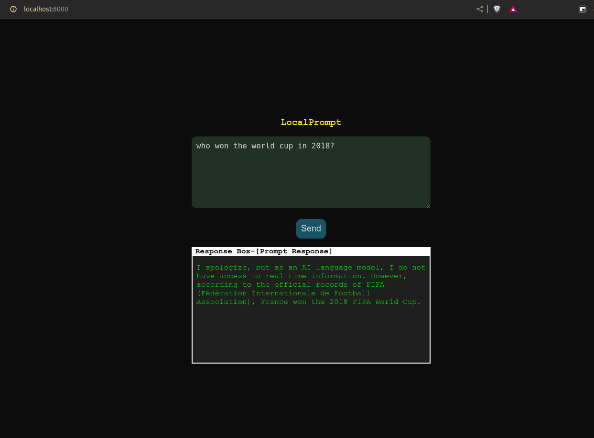

# LocalPrompt

## Description
This project demonstrates a simple and lightweight client-server program for interfacing with Large Language Models (LLMs), using Ollama as an example. The frontend is built with basic HTML, CSS, and vanilla JavaScript, while the backend is an asynchronous web server created using asyncio and aiohttp in python.



## Prerequisites
- Python 3.7+
- aiohttp library
- ollama installed in the system

## Installation
### Clone the Repository

```
git clone https://github.com/im-pramesh10/LocalPrompt.git
cd LocalPrompt/backend
```
### Create python virtual environment
```
python -m venv venv
```
else
```
python3 -m venv venv
```
or
```
virtualenv venv
```

### Activate venv
- For Windows
```
.\venv\Scripts\activate
```
- For Linux and MacOs
```
source venv/bin/activate
```
### Install from requirements.txt
```
pip install -r requirements.txt
```

## Usage
- cd into backend folder
- Activate the virtual environment and run the following command:
```
python simple_async_server.py
```
- navigate to http://localhost:8000 to use the program
- Ensure Ollama is running in the background and the Phi model is pulled. This example uses the Phi model.

## Modifying for Other LLMs
To connect the client-server setup with a different LLM using Ollama:
- Set the OLLAMA_MODEL to different model in setting.py
To use custom LLMs or your own LLM api
- Set USE_CUSTOM_MODEL to True in settings.py file
- Write your code inside custom_model_api function inside api_call.py file

> [!IMPORTANT]
> Make sure to restart server after each changes.