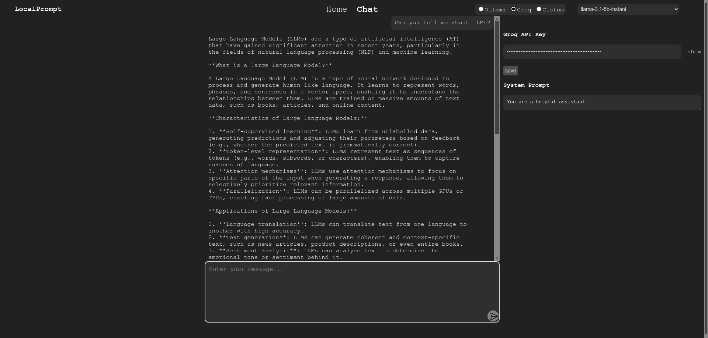
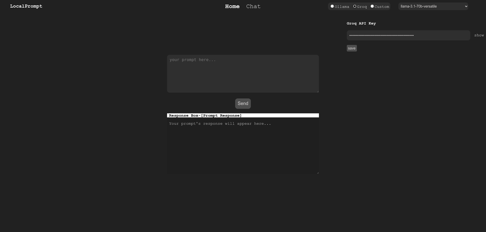

# LocalPrompt

## Description
This project is a simple and lightweight client-server program for interfacing with local LLMs using ollama, and LLMs in groq using groq api.

This project demonstrates a simple and lightweight client-server program for interfacing with Large Language Models (LLMs) on your local machine using ollama and also interfacing groq using groq api.




## Prerequisites

- Python 3.7+
- aiohttp library
- ollama installed in the system

## Installation

### Clone the Repository

```
git clone https://github.com/im-pramesh10/LocalPrompt.git
cd LocalPrompt/backend
```

### Create python virtual environment

```
python -m venv venv
```

else

```
python3 -m venv venv
```

or

```
virtualenv venv
```

### Activate venv

- For Windows

```
.\venv\Scripts\activate
```

- For Linux and MacOs

```
source venv/bin/activate
```

### Install from requirements.txt

```
pip install -r requirements.txt
```

## Usage

- cd into backend folder
- Activate the virtual environment and run the following command:

```
python simple_async_server.py
```

- navigate to http://localhost:8000 to use the program
- you can change your default port from setting.py
- Ensure Ollama is running in the background and the Phi model is pulled. This example uses the Phi model.

## Modifying for Other LLMs
### For single prompt
To connect LocalPrompt setup with a different LLM using Ollama:
- Write your code inside custom_model_api function inside api_call.py file
- Return your response in the following format:

```
{'response':'You need to set up your custom model function inside api_call.py file inside backend folder'}
```

> [!NOTE]
> Make sure to restart server after each changes.
